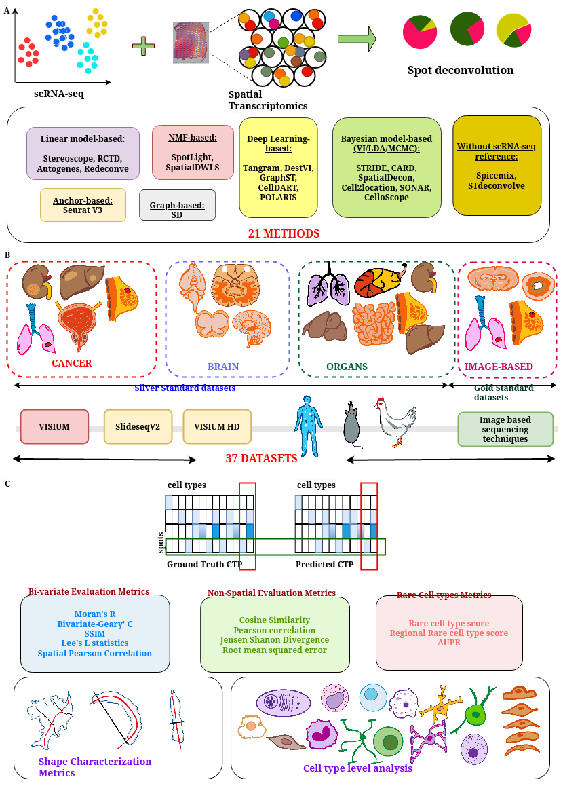

# spDDB
A Comprehensive Benchmarking of Spatial Deconvolution and Domain Detection Methods across Diverse Tissues and Spatial Transcriptomic Technologies

The Github provides installation instructions, set up and runnable files used in the benchmarking. The overview of the benchmarking is as follows.



## Installation

We recommend users to directly clone our stable `main` branch and create conda environment of benchmarking methods using yml files provided in ./ENVIRONMENTS/. Executing these yml files will install all required packages and dependencies. Below is an example showing how to create environments for SynthST and a benchmarking method.

```
git clone https://github.com/Zafar-Lab/spDDB.git
cd spDDB/Environments

conda env create -f SynthST.yml
conda activate SynthST

conda env create -f method_name.yml
conda activate method_name

```

## What Computational tasks can spDDB be used for?

`spDDB` can be used for:
1. Benchmarking study of spatial deconvolution methods
2. Benchmarking study of domain detection methods
3. Providing a suite of evaluation metrics for spatial transcriptomics, including bivariate spatial metrics, cell-type shape characterization metrics, and rare cell-type metrics
4. Simulating synthetic spatial transcriptomics data and synthetic cell-type proportions using `spDDB`
5. Rich spatial dataset repository spanning brain, cancer and organs across tissue, species and technologies.

## spDDB Website
The synthetic datasets are available for download from: [https://zafar-lab.github.io/spDDB_datasets.github.io/](https://zafar-lab.github.io/spDDB_datasets.github.io/)

## Contributing
In case of any bug reports, enhancement requests, general questions, and other contributions, please create an issue. For more substantial contributions, please fork this repo, push your changes to your fork, and submit a pull request with a good commit message.

## Cite this article
Ajita Shree, Aditya V, Tanush Kumar and Hamim Zafar, A Comprehensive Benchmarking of Spatial Deconvolution and Domain Detection Methods across Diverse Tissues and Spatial Transcriptomic Technologies
