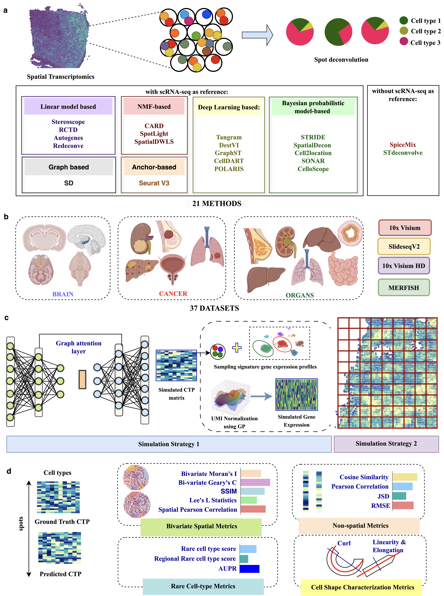

spDDB
======

A Comprehensive Benchmarking of Spatial Deconvolution and Domain Detection Methods across Diverse Tissues and Spatial Transcriptomic Technologies.

Paper: https://doi.org/10.64898/2026.05.11.724248

Installation
------------

Clone the repository at https://github.com/Zafar-Lab/spDDB_datasets.github.io and create the required conda environments using the environment files provided in ``./Environments/``.

We recommend using the stable ``main`` branch.

.. code-block:: bash

   git clone https://github.com/Zafar-Lab/spDDB.git
   cd spDDB/Environments

   conda env create -f SynthST.yml
   conda activate SynthST

   conda env create -f method_name.yml
   conda activate method_name

What Computational Tasks Can spDDB Be Used For?
-----------------------------------------------

``spDDB`` provides a comprehensive framework for:

#. Benchmarking spatial deconvolution methods.
#. Benchmarking spatial domain detection methods.
#. Evaluating spatial transcriptomics methods using a rich collection of metrics, including:

   * Bivariate spatial metrics
   * Cell-type shape characterization metrics
   * Rare cell-type metrics

#. Simulating synthetic spatial transcriptomics datasets and cell-type proportions using ``SynthST``.
#. Accessing a diverse repository of spatial transcriptomics datasets spanning multiple tissues, species, and technologies.

spDDB Dataset Repository
------------------------

Synthetic datasets and benchmarking resources are available at:

https://zafar-lab.github.io/spDDB_datasets.github.io/

Contributing
------------

We welcome bug reports, enhancement requests, and general questions through GitHub Issues.

For substantial contributions:

#. Fork the repository.
#. Create a feature branch.
#. Commit your changes with clear commit messages.
#. Submit a pull request for review.

Citation
--------

If you use spDDB in your research, please cite:

Ajita Shree, Aditya V\*, Tanush Kumar\*, and Hamim Zafar.

*A Comprehensive Benchmarking of Spatial Deconvolution and Domain Detection Methods across Diverse Tissues and Spatial Transcriptomic Technologies.*

\* Equal contribution.

https://doi.org/10.64898/2026.05.11.724248

Tutorials
---------

.. toctree::
   :maxdepth: 1

   tutorials/1_SynthST_generate_synthetic_cell_type_proportions
   tutorials/2_SynthST_generate_synthetic_spatial_gene_expression
   tutorials/3_SynthST_Simulation_strategy2_Lung_Cancer
   tutorials/4_spDDB_deconvolution_evaluation
   tutorials/5_spDDB_rare_celltype
   tutorials/6_spDDB_shape_characterization
